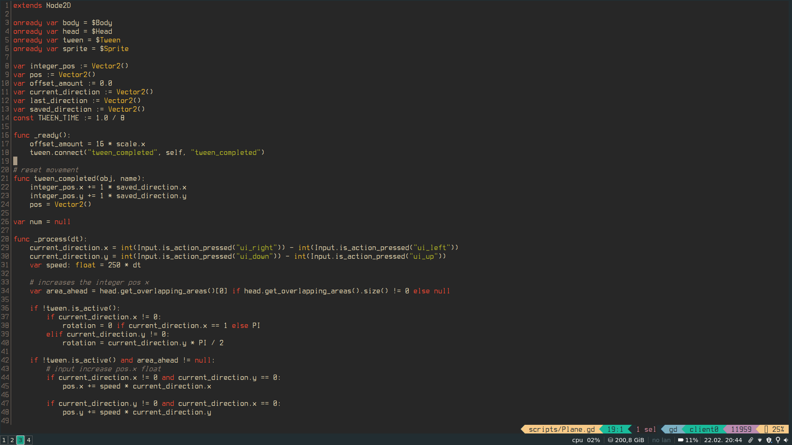

# gdscript-kak
[Kakoune](https://kakoune.org/) syntax highlighting for the [Godot Engine](https://godotengine.org/) / Godot Scripting Language gdscript.
Adds basic syntax highlighting to your .gd files for every class in Godot.
Also contains useful snippets that you can use via [kakoune-snippets](https://github.com/occivink/kakoune-snippets).

# Install
Add the 2 folder to your `~/.config/kak/` dir or to `/usr/share/kak/`.

# Note 
The snippets sometimes contain my name, so you should probably edit them to your one.
Also be careful with tabs in the snippets since they gete parsed as 4 whitespaces instead of a tab, making gdscript fail at compiling. That caught me of guard sometimes. 

# Contribution
If you have any useful snippets that you want to share you can simply add a pull request.
I feel like gdscript doesnt have too many things you can shortcut, so things like the `iff` snippet are there if i know it's going to have branches. Writing a basic `if condition:` isn't complex enough to justify a snippet imo.

# Screenshot

